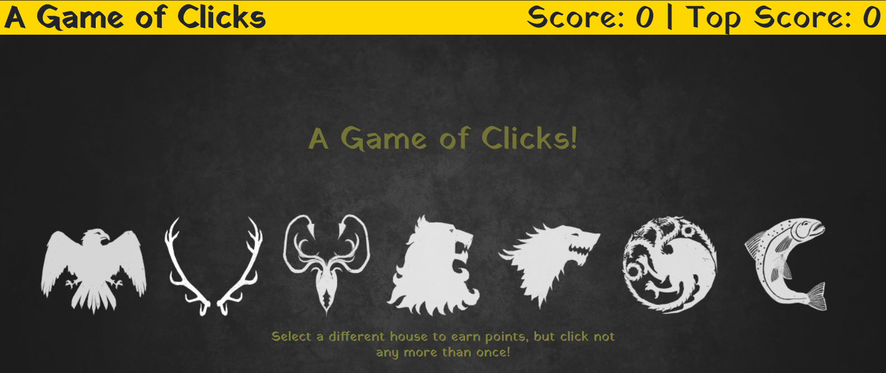

# AGameOfClicks
This is a memory testing game with a Game of Thrones theme behind it!

This App highlights the use of React with building out an application on the front-end.

The site will immediately take you to the landing page as shown above.

If you scroll down you will find 12 shields with the crests of the Great Houses of Westeros.

Click on all of the sheilds only one time to get the top score. Everytime you click on a shield they will scramble positions. Try to recall what you've already clicked on and get the top score!

